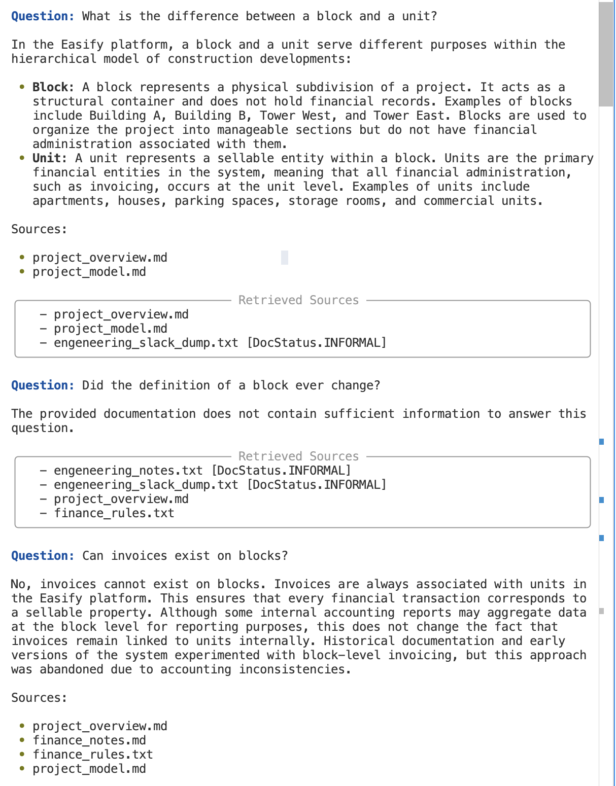

# Easify RAG System

A Retrieval-Augmented Generation system that answers questions about the Easify construction software platform, grounded exclusively in internal documentation.

## Quick Start

```bash
# Prerequisites: Python 3.11+

# 1. Set up environment
cd florian
python3.11 -m venv .venv
source .venv/bin/activate
pip install -e . #This will take a while due to sentence-transformers and chromadb dependencies - be patient

# 2. Configure API key
cp .env.example .env
# Edit .env and add your OpenAI API key - We use GPT-4o for generation and text-embedding-3-small for embeddings, both available with the same API key.

# 3. Run interactive mode - Default
python cli.py

# Or ask a single question
python cli.py ask "What is the difference between a block and a unit?"

# Run with verbose retrieval details
python cli.py -v ask "Can invoices exist on blocks?"

# Run the evaluation suite
python cli.py evaluate

# Force rebuild of the index
python cli.py --reindex
```

## Example Conversation



## Architecture

```
Question
  │
  ├─► OpenAI Embedding ─► ChromaDB Vector Search ──┐
  │                                                  ├─► Reciprocal Rank Fusion
  └─► BM25 Tokenization ─► BM25 Keyword Search ────┘
                                                      │
                                                      ▼
                                              Cross-Encoder Re-ranking
                                                      │
                                                      ▼
                                              Prompt Assembly (with metadata labels)
                                                      │
                                                      ▼
                                              GPT-4o Answer Generation
                                                      │
                                                      ▼
                                              Answer + Source Citations
```

### Pipeline Stages

1. **Ingestion** — Reads all 14 documents from `/files/`, handling mixed formats (.md, .txt, no extension). Each document is classified as `current`, `archived`, or `informal` based on content signals (e.g., "ARCHIVED DOCUMENT", "Internal notes").

2. **Chunking** — The corpus totals ~1,500 words across 14 documents. Documents under 120 words are kept whole; larger ones are split by section boundaries with a 300-word hard cap and 40-word overlap between consecutive chunks.

3. **Dual Indexing** — Each chunk is indexed in both:
   - **ChromaDB** with OpenAI `text-embedding-3-small` embeddings (semantic search)
   - **BM25** keyword index (exact term matching)

4. **Hybrid Retrieval** — Both indexes are queried, results merged via **Reciprocal Rank Fusion** (RRF). Document metadata weights are applied: current docs score full weight, archived docs are softly deprioritized (0.6x), informal docs slightly deprioritized (0.7x).

5. **Re-ranking** — Top candidates are re-scored with a **cross-encoder** model (`ms-marco-MiniLM-L-6-v2`) for precision. This is optional and can be disabled in `config.py`.

6. **Generation** — The top 5 chunks (with source/status labels) are passed to GPT-4o with a system prompt that instructs it to: only use provided context, prefer current over archived sources, cite sources, and refuse when information isn't available.

### Key Design Decisions

- **No framework (LangChain/LlamaIndex)** — The corpus is small enough that building from primitives (OpenAI SDK + ChromaDB + rank_bm25) keeps the code transparent and each component easily testable.

- **Soft metadata weighting instead of hard filtering** — Archived documents are deprioritized but not excluded. This allows the system to surface historical context when relevant (e.g., "Why was block-level invoicing removed?") while preferring current documentation for factual questions.

- **Hybrid search (vector + BM25)** — Vector search catches paraphrased queries; BM25 catches exact terminology. RRF combines both signals without requiring learned weights.

- **Smart chunking** — With only ~1,500 words total, most documents stay whole. Larger documents are split at section boundaries with overlap, preserving context while keeping chunks manageable.

## Handling Messy Documentation

The `/files/` dataset contains deliberate challenges:

| Challenge | How it's handled |
|-----------|-----------------|
| **Duplicate info** (e.g., `project_model.md` ≈ `project_overview.md`) | Both are indexed; RRF naturally handles duplicates by boosting chunks that appear in both retrievers |
| **Contradictions** (archived docs say block invoices existed) | Metadata labels in the prompt let GPT-4o distinguish current from archived sources |
| **Deprecated content** (`archived_specs_2019.md`) | Classified as "archived" via content detection; soft-weighted down in retrieval |
| **Informal sources** (engineering notes, Slack dumps) | Classified as "informal"; included with caveats in generated answers |
| **File without extension** (`supplier_workflow`) | Loader reads all files regardless of extension |

## Configuration

Key settings are in `config.py`:

| Setting | Default | Description |
|---------|---------|-------------|
| `LLM_MODEL` | `gpt-4o` | OpenAI model for answer generation |
| `EMBEDDING_MODEL` | `text-embedding-3-small` | Embedding model |
| `USE_CROSS_ENCODER` | `True` | Enable/disable cross-encoder re-ranking |
| `RETRIEVAL_TOP_K` | `10` | Results per retriever before fusion |
| `RERANK_TOP_N` | `5` | Final chunks sent to LLM |
| `LLM_TEMPERATURE` | `0.1` | Low for factual consistency |
| `RRF_K` | `60` | Reciprocal Rank Fusion smoothing constant |
| `CONFIDENCE_THRESHOLD` | `-3.0` | Cross-encoder score below which answers are refused without LLM call |
| `LLM_MAX_TOKENS` | `1024` | Maximum tokens for LLM response |

Set `USE_CROSS_ENCODER = False` to skip the ~500MB model download (falls back to RRF-only ranking).

## Evaluation

```bash
python cli.py evaluate
```

Runs 32 test cases covering:
- Core factual questions (hierarchy, permissions, invoicing, suppliers)
- Contradiction handling (block vs unit invoicing across current/archived docs)
- Edge cases (post-completion costs, rejected proposals, price changes)
- Out-of-scope refusal (Stripe, mobile app, authentication)

Each test checks retrieval quality (correct source files retrieved) and answer quality (required phrases present, forbidden phrases absent).

## Architecture Reasoning

### Why the dataset size drives every decision

The entire corpus is ~11 KB across 14 files (~594 lines). This is smaller than a single README in most projects. Consequences:

- **No need for a hosted vector DB** (Pinecone, Weaviate). ChromaDB running locally with SQLite is zero-config, zero-cost, and more than sufficient. It eliminates infrastructure dependencies and makes the project trivially reproducible.
- **Chunking is less critical than in production** — but still worth doing right. Most documents are small enough to keep whole, preserving full context. Only the larger ones get split at section boundaries.
- **The real challenge is the messy/contradictory docs**, not scale. The `archived_specs_2019.md`, `historical_changes.md`, and `engeneering_slack_dump.txt` contain outdated information that could mislead the LLM. This is what the system is actually being tested on.

### Why Python

The RAG ecosystem is Python-first: OpenAI SDK, ChromaDB, sentence-transformers, rank_bm25 all have Python as their primary or only SDK. For a time-boxed exercise, this is the path of least resistance.

### Why no framework (LangChain / LlamaIndex)

With 14 small documents, a framework adds abstraction layers without solving any real problem. Building from primitives (OpenAI SDK + ChromaDB + rank_bm25) keeps every component visible and debuggable. Each stage — ingestion, chunking, indexing, retrieval, generation — is a small, readable module.

### Why hybrid search (vector + BM25) with RRF

Vector search alone misses exact terminology; keyword search alone misses paraphrased queries. Reciprocal Rank Fusion merges both signals without requiring learned weights — it's a simple, effective baseline that outperforms either retriever alone.

### Why soft metadata weighting instead of hard filtering

Archived documents are deprioritized (0.6x) but not excluded. This lets the system answer historical questions ("Why was block-level invoicing removed?") using archived sources while preferring current documentation for factual questions. Hard filtering would lose that capability.

### Why the grounding prompt matters most

The evaluators explicitly test for no hallucination and correct handling of contradictions. The generation prompt instructs GPT-4o to: only use provided context, prefer current over archived sources, cite sources by filename, and explicitly refuse when the context doesn't contain the answer. This is where the exercise is won or lost — retrieval gets the right chunks, but the prompt determines whether the LLM stays faithful to them.

### Why include an evaluation suite

Having test cases with expected answers demonstrates engineering maturity. It shows the system's correctness is verifiable, not just claimed. The 32 test cases cover core facts, contradiction handling, edge cases, and out-of-scope refusal.

## Improvements With More Time

- **Chunk deduplication** — Detect near-duplicate chunks at index time and merge them to reduce noise
- **Query expansion** — Rephrase the user's question multiple ways to improve recall
- **Streaming responses** — Stream GPT-4o output for better UX
- **Confidence scoring** — Return a confidence score based on retrieval similarity, so the UI can flag uncertain answers
- **Fine-tuned embeddings** — Train domain-specific embeddings on the Easify vocabulary
- **Web UI** — A simple chat interface with source highlighting

## Known Limitations & Tradeoffs

### Scalability

- BM25 scores all chunks in memory — O(n) per query, fine for 14 docs, would need Elasticsearch/Tantivy at scale
- No incremental BM25 updates — adding one doc rebuilds the entire index (vector store does support incremental updates)
- Single-threaded document loading and chunking — no parallelism
- Single ChromaDB collection — no sharding or partitioning

### Design tradeoffs (conscious choices for a CLI demo)

- Global mutable state for clients (`_chroma_client`, `_openai_client`, etc.) — simple for CLI, wouldn't work for concurrent/server use
- No dependency injection — modules import concrete implementations directly
- Citation validation only checks `.md`/`.txt` extensions — sufficient for current dataset

### Testing gaps

- No tests for CLI commands or the evaluation runner itself
- Cross-encoder reranker only tested via fallback path (actual model requires 500MB download)
- No property-based testing / fuzzing

## Project Structure

```
florian/
├── cli.py              # CLI entry point (click + rich)
├── pipeline.py         # End-to-end RAG orchestrator
├── config.py           # Central configuration
├── models.py           # Data classes (Document, Chunk, RetrievalResult)
├── pyproject.toml      # Package definition and dependencies
├── example-flow.png    # Example conversation screenshot
├── ingest/             # Document loading, metadata classification, chunking
├── index/              # Embedding generation, ChromaDB, BM25
├── retrieve/           # Hybrid search (RRF) and cross-encoder re-ranking
├── generate/           # Prompt templates and LLM wrapper
├── evaluate/           # Test cases and evaluation runner
└── tests/              # Unit and integration tests (14 test files)
```